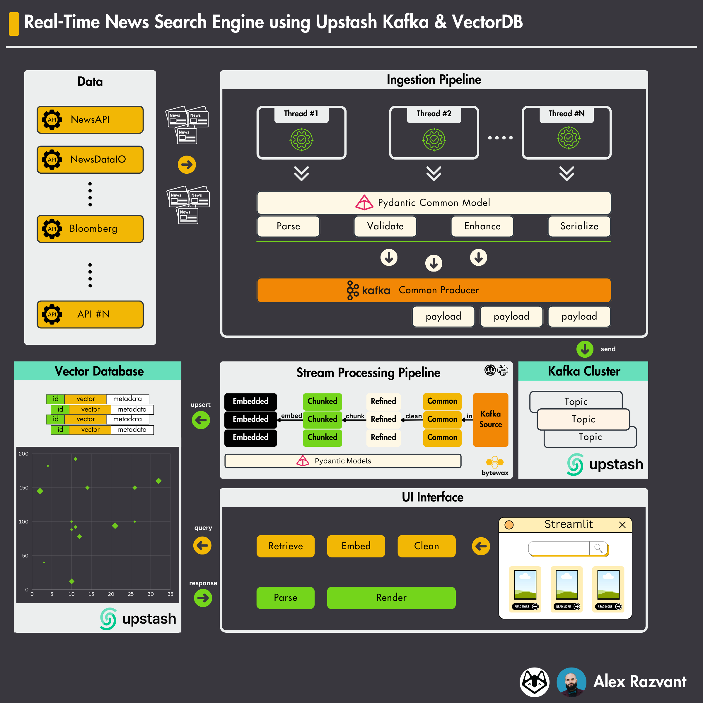

# Real-time news search engine using Upstash Kafka and Vector DB

In this article, we'll go over how you can design, build and operate a real-time news search engine using live ingested data from various news APIs.

In today's digital age, we could say that the flux of data has grown exponentially, requiring accurate acquisition, curation, parsing, categorization, and organization into a coherent structure. With the recent advancements of LLM and AI Generated content, it might become hard for you to filter your information stream. The scope of this article is to tackle just that - by providing a customizable way of updating your Knowledge Base. In real-world scenarios, data is flowing continuously, it requires constant fetching, curating, parsing, grouping and presenting it in a structured format.
We have the popular Yahoo-Finance for finance, HackerRank for tech, ESPN for sports, all these platforms follow an underlying principle - provide niched, high-quality news articles.

This pattern of the application we're going to build is commonly used as part of RAGs, the only difference here being that we won't use an LLM, but actually focus on the Data Ingestion, Processing and Retrieval  - which are the key points of a RAG. 

> **_NOTE:_**  However, extensibility won't be a problem, since you'll be able to customize and feed the retrieved content to an LLM easily by routing it through a PromptTemplate, and then pass it to an LLM for analysis, summarisation or any other task.



<b>Here's what we're going to learn how to: </b>
- ingest articles from news APIs
- spawn multiple Kafka Producer threads and push messages to Upstash Kafka cluster
- use Bytewax to process payloads from Kafka
- parse, chunk, embed using Pyndatic models and upsert to Upstash Vector Database
- build a UI interface with a search bar, and render results from Vector Database

## Table of Contents

- [Articles](#articles)
- [Dependencies](#dependencies)
- [Install](#install)
- [Usage](#usage)
- [Notes](#notes)
- [License](#license)
- [Author](#contributors)


## Articles

This is a code-first summary version, make sure to read the article in full ↓

1. [Summary]()
2. [Full](https://medium.com/decodingml/how-to-build-a-real-time-news-search-engine-using-serverless-upstash-kafka-and-vector-db-6ba393e55024)

## Dependencies

- [Python (version 3.19)](https://www.python.org/downloads/)
- [Miniconda (version 24.1.2)](https://docs.anaconda.com/free/miniconda/index.html)
- [Poetry (version 1.7.1)](https://python-poetry.org/)
- [GNU Make (version 3.81)](https://www.gnu.org/software/make/)
- [Docker (version 24.0.7)](https://www.docker.com/)


## Install
We're using Poetry to manage the env and dependencies of this project.
<b> You don't need a GPU to run this </b>

To install, run this following command:
```shell
make install
```
This will create a new conda environment called `py39upstash`, activate it and install dependencies defined in `pyproject.toml`.

## Usage
The `Makefile` found at the root of this project, contains 5 commands:
- `test` : will run the defined unit tests
- `run_producers` : will start the Kafka Producer Threads that ingest from NewsAPIs
- `run_pipeline`  : will start the Bytewax Stream Processing consumer to parse messages from Kafka, embed and push to VectorDB
- `clean_vdb`     : [WARNING] This is used to purge the VectorDB
- `run_ui`        : will start the interactive Streamlit UI.

Here's the full command-set to start the solution:
1. Start Producers          : `make run_producers`
2. Start Bytewax Consumer   : `make run_pipeline`
3. Start UI                 : `make run_ui`

## Notes

> **_NOTE:_**  
> To ingest News Articles, we're using 2 APIs which offer free-tier access:
1. NewsAPI
    - Articles fetched from here have their `content` field limited to 260 characters. You can get the full-content with a paid plan, but for our use-case is more than enough.
    - Payload Example:
```
{
    "source": {
        "id": null,
        "name": "News18"
    },
    "author": "News18",
    "title": "Still Using Paytm FASTag? Here Is A Step-by-Step Guide To Port To A New FASTag - News18",
    "description": "NHAI suggests users acquire FASTags from the 32 banks that are now on the authorised list for FASTag issuing",
    "url": "https://www.news18.com/business/still-using-paytm-fastag-here-is-a-step-by-step-guide-to-port-to-a-new-fastag-8814964.html",
    "urlToImage": "https://images.news18.com/ibnlive/uploads/2024/02/untitled-design-2024-02-12t023732.441-2024-02-d1cbfb73a1fd442b891b3917ea3d4de1-16x9.jpg?impolicy=website&width=1200&height=675",
    "publishedAt": "2024-03-14T12:18:27Z",
    "content": "In a recent move, the Reserve Bank of India (RBI) ordered Paytm Payments Bank Ltd. (PPBL) to cease taking deposits or top-ups in any client accounts including wallets and FASTags after February 29, 2\u2026 [+3529 chars]"
}
```
2. NewsDataIO
    - Articles fetched from this API, have their full-content field masked, but provide a description field which represents the content summary.
    - Payloads from here have more fields compared to API #1, but still some are available only on paid plans.
    - Payload example:
```
{   
    "article_id": "0b09d2891dcb9085f2d5201249356458", 
    "title": "Top events of the day: From PM Modi's Kerala visit to Russian presidential elections, track top news on March 15 here", 
    "link": "https://www.livemint.com/news/india/top-events-of-the-day-from-pm-modis-kerala-visit-to-russian-presidential-elections-track-top-news-on-march-15-here-11710464847509.html",
    "keywords": "None", 
    "creator": "None", 
    "video_url": "None", 
    "description": "Top news of the day: PM Modi's Lok Sabha poll campaign in Kerala, Rahul Gandhi to address a public rally in Bhiwandi, deadline of advance tax payment, Russia's presidential elections, and more", 
    "content": "ONLY AVAILABLE IN PAID PLANS",
    "pubDate": "2024-03-15 01:42:57", 
    "image_url": "https://www.livemint.com/lm-img/img/2024/03/15/1600x900/Modi-16_1710466650723_1710466677228.jpg", 
    "source_id": "livemint", 
    "source_url": "https://www.livemint.com", 
    "source_icon": "https://i.bytvi.com/domain_icons/livemint.png", 
    "source_priority": 7134, 
    "country": ["india"], 
    "category": ["top"], 
    "language": "english", 
    "ai_tag": "ONLY AVAILABLE IN PROFESSIONAL AND CORPORATE PLANS", 
    "sentiment": "ONLY AVAILABLE IN PROFESSIONAL AND CORPORATE PLANS", 
    "sentiment_stats": "ONLY AVAILABLE IN PROFESSIONAL AND CORPORATE PLANS", 
    "ai_region": "ONLY AVAILABLE IN CORPORATE PLANS"
}
```

## License

This article is an open-source project released under the MIT license. Thus, as long you distribute our LICENSE and acknowledge our work, you can safely clone or fork this project and use it as a source of inspiration for whatever you want (e.g., work, university projects, college degree projects, etc.).


## Author

<table>
  <tr>
    <td><a href="https://github.com/Joywalker" target="_blank"></a></td>
    <td>
      <strong>Razvant Alex</strong><br />
      <i>Senior ML Engineer</i>
    </td>
  </tr>
</table>

