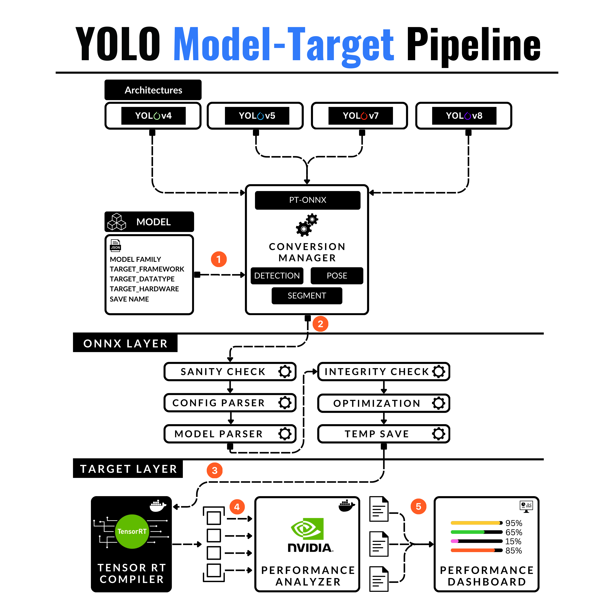

# Deploy Deep Learning Models at Scale using NVIDIA Triton Inference Server

**Here's what we'll learn**

## Table of Contents

- [Deploy Deep Learning Models at Scale using NVIDIA Triton Inference Server](#deploy-deep-learning-models-at-scale-using-nvidia-triton-inference-server)
  - [Table of Contents](#table-of-contents)
  - [Articles](#articles)
  - [Dependencies](#dependencies)
  - [Install](#install)
  - [Usage](#usage)
  - [License](#license)
  - [Contributors](#contributors)

------

## Articles

To fully grasp the code, check out our articles ↓

1. [Full Article](https://decodingml.substack.com/p/dml-how-to-deploy-deep-learning-models)

## Dependencies

- [Python (version 3.9)](https://www.python.org/downloads/)
- [Poetry (version 1.6.1)](https://python-poetry.org/)
- [GNU Make (version 3.81)](https://www.gnu.org/software/make/)
- [Docker (version 24.0.7)](https://www.docker.com/)

## Install

## Usage

## License

This article is an open-source project released under the MIT license. Thus, as long you distribute our LICENSE and acknowledge our work, you can safely clone or fork this project and use it as a source of inspiration for whatever you want (e.g., work, university projects, college degree projects, etc.).

## Contributors

<table>
  <tr>
    <td></td>
    <td>
      <strong>Alex Razvant</strong> 
      <i>Senior Machine Learning Engineer</i>
    </td>
  </tr>
</table>